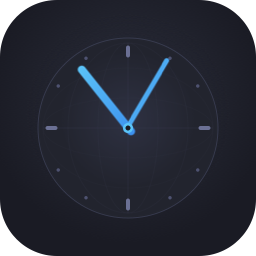
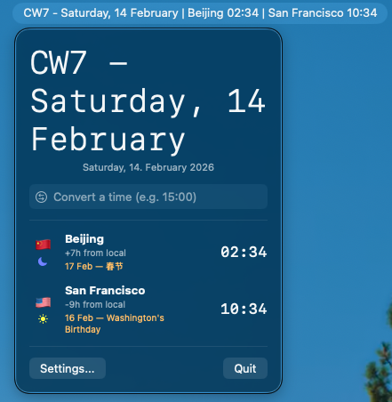
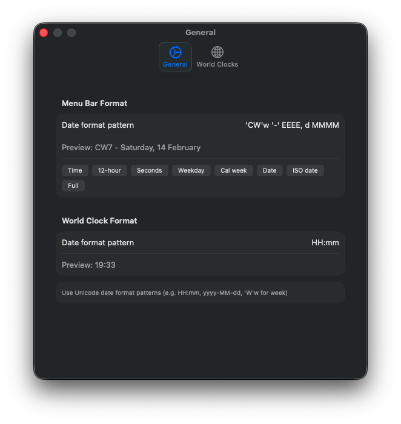
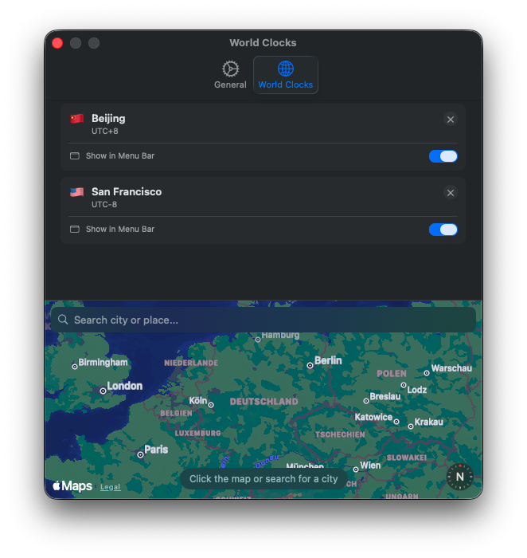

<p align="center">
  
</p>

<h1 align="center">Clock</h1>

<p align="center">
  <a href="https://github.com/sven-ericmolzahn/Clock/actions/workflows/release.yml"></a>
  <a href="https://github.com/sven-ericmolzahn/Clock/releases/latest"></a>
  <a href="LICENSE"></a>
</p>

<p align="center">A lightweight macOS menubar app for keeping track of time across the world.</p>

Clock lives in your menu bar and shows the current time in a fully customizable format. Click it to see all your configured world clocks at a glance, complete with country flags, day/night indicators, and upcoming public holidays.

## Screenshots

| Menu Bar Panel | Settings — General | Settings — World Clocks |
|:-:|:-:|:-:|
|  |  |  |

## Features

- **Menubar clock** with customizable format (24h, 12h, calendar week, date, and more)
- **World clocks** — add cities by clicking an interactive map or searching by name
- **Per-clock menu bar toggle** — choose which clocks appear in the menu bar alongside your local time
- **Public holidays** — shows the next public holiday for each clock's country, fetched from the Nager.Date API
- **Day/night indicator** — sun or moon icon based on the local hour at each location
- **Tomorrow/yesterday badge** — clearly marks when a clock's date differs from yours
- **Country flags** — derived automatically from the timezone
- **Quick time converter** — type a time (e.g. "15:00") and instantly see what that is in every configured timezone
- **Launch at login** — optionally start Clock when you log in
- **Drag to reorder** — arrange your clocks in the order you prefer
- **Inline label editing** — rename any clock directly in settings

## Installation

### Homebrew

```bash
brew tap sven-ericmolzahn/clock
brew install --cask clock
```

### Download

Download the latest DMG from the [Releases](https://github.com/sven-ericmolzahn/Clock/releases) page, open it, and drag Clock to your Applications folder.

### Build from source

Requires macOS 26.1 and Xcode 26.

```bash
git clone https://github.com/sven-ericmolzahn/Clock.git
cd Clock
xcodebuild -project Clock.xcodeproj -scheme Clock build
```

Or open `Clock.xcodeproj` in Xcode and press Cmd+R.

## Run Tests

```bash
xcodebuild -project Clock.xcodeproj -scheme Clock -destination 'platform=macOS' test
```

## Architecture

Clock is a SwiftUI menubar-only app (`LSUIElement = YES`) with no dock icon or main window.

- **AppState** — `@Observable` singleton managing settings, world clocks, a 1-second timer, and the holiday service
- **MenuBarPanel** — the popover shown when clicking the menubar icon: local clock, world clocks, time converter, and settings/quit buttons
- **WorldClock** — `Codable` model storing label, timezone identifier, country code, and menu bar visibility
- **HolidayService** — fetches upcoming public holidays per country from the Nager.Date API, with a timezone-to-country fallback via the system zone.tab file
- **MapTimeZonePicker** — interactive MapKit map with floating overlay cards for adding clocks by click or search
- **Settings** — tabbed window with General (format presets, world clock format, launch at login) and World Clocks (card-based list with inline editing, reorder, per-clock menu bar toggle)

Settings and world clocks are persisted via UserDefaults.

## Contributing

Contributions are welcome. To get started:

1. Fork the repository
2. Open `Clock.xcodeproj` in Xcode 26 — it will auto-sign with your personal development certificate
3. Create a feature branch and make your changes
4. Make sure the project builds cleanly
5. Open a pull request with a clear description of what you changed and why

If you're planning a larger change, consider opening an issue first to discuss the approach.

## License

This project is licensed under the [MIT License](LICENSE).
